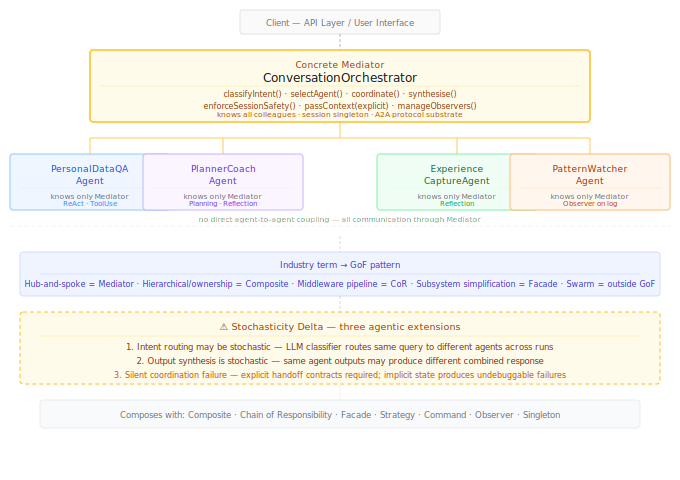

# Mediator {#sec-mediator}

::: {.pattern-category}
Behavioural · Pattern 11 of 14
:::

::: {.gof-box}
Define an object that encapsulates how a set of objects interact. Mediator promotes loose coupling by keeping objects from referring to each other explicitly, and it lets you vary their interaction independently.

::: {.gof-source}
@gamma1994design, p. 273
:::
:::

## The Translation Argument

The Mediator pattern solves a coupling problem. When a set of objects need to interact — but direct references between them would create a tightly coupled mesh where every change potentially breaks every other object — a central Mediator encapsulates the interaction logic. Objects communicate through the Mediator, not with each other. The Mediator knows all objects; the objects know only the Mediator. Interaction logic lives in one place, independently variable and independently testable.

In agentic AI, this is the dominant production architecture. The industry currently calls it hub-and-spoke or orchestrator-worker. A central orchestrator agent receives tasks, routes them to specialised worker agents, coordinates multi-step workflows, and synthesises outputs. Workers communicate only through the orchestrator — they have no direct awareness of each other. This is precisely the Mediator pattern, and industry data confirms it as the most widely deployed multi-agent architecture in production [@agentsindex2026multiagent; @augmentcode2026hubspoke].

The industry does not consistently distinguish this pattern from related patterns it conflates with it. This catalogue makes those distinctions precise. Four patterns in the current practitioner literature map to distinct GoF patterns:

- **Hub-and-spoke / orchestrator-worker** — central coordinator, peer workers, no direct agent-to-agent communication, coordinator synthesises outputs → **Mediator**
- **Hierarchical / supervisor-worker** — supervisor owns sub-agents, is responsible for their outputs, tree structure with parent-child authority → **Composite**
- **Peer-to-peer / mesh** — agents maintain direct connections to peers, communicate without a central hub → direct coupling, no central pattern
- **Swarm / dynamic self-organisation** — agents self-organise based on expertise, no fixed structure → outside the GoF catalogue

The distinction between Mediator and Composite is the one the industry most commonly collapses. Both involve a central component coordinating others. The difference is ownership and accountability: **Mediator** coordinates peers without owning them — agents are independent, the Mediator manages their interaction. **Composite** owns its children and is responsible for their outputs — the parent node carries authority over its sub-tree. In production systems this distinction determines where accountability for outputs lives.

The four GoF roles translate as follows:

| GoF Role | Agentic Equivalent | Responsibility |
|---|---|---|
| Mediator | `AgentMediator` interface | Defines the coordination interface. Receives requests from colleagues. Routes, coordinates, and synthesises. |
| Concrete Mediator | `ConversationOrchestrator` | Knows all colleague agents. Implements intent classification, agent selection, context passing, output synthesis, and session-level safety enforcement. |
| Colleague | `PersonalDataQAAgent`, `PlannerCoachAgent`, `ExperienceCaptureAgent`, `PatternWatcherAgent` | Each knows only the Mediator. Does not know about other colleagues. |
| Client | API layer, user interface | Submits requests to the Mediator. Receives synthesised responses. Unaware of the agent collective. |

: GoF roles translated to the agentic hub-and-spoke coordination context {#tbl-mediator-roles}

The responsible AI implication is direct. The Mediator is the natural place to enforce session-level safety invariants that transcend individual agent outputs. If a user modifies consent mid-session, the Mediator propagates that change to all subsequent agent calls — even though individual agents are stateless between calls. Without a Mediator, session-level consistency of this kind is difficult to guarantee architecturally.

The pattern also connects to the Agent-to-Agent (A2A) protocol emerging as the communication substrate for multi-agent systems [@chua2026orchestration]. The Mediator defines the coordination structure that A2A implements at the communication layer. Systems built on A2A are, structurally, Mediator implementations.

## Pattern Distinctions {#sec-mediator-tensions}

::: {.callout-note .callout-tension}
## Mediator vs Composite vs Chain of Responsibility vs Facade

All four patterns involve a central component managing interactions with others. The distinctions determine which pattern applies and where accountability lives.

**Mediator** coordinates bidirectional peer communication. No agent owns another. Best for: orchestrating a known, fixed set of independent agents whose outputs need synthesis — the hub-and-spoke production pattern.

**Composite** structures hierarchical ownership. The composite node owns its children and is accountable for their outputs. Best for: nested pipeline structures and hierarchical task decomposition where parent nodes carry authority.

**Chain of Responsibility** routes linearly through decoupled handlers. No handler has a global view. No handler owns another. Best for: middleware pipelines and escalation chains where handlers should be unaware of each other.

**Facade** simplifies one-directional subsystem access. The subsystem does not know about clients. Communication is one-directional, not coordinating. Best for: hiding complex subsystem internals behind a clean interface.

In NLI: `ConversationOrchestrator` is a Mediator. Nested pipelines are Composites. The `nli_api` pipeline is a Chain of Responsibility. The `DataProductAccessAgent` is a Facade. All four appear simultaneously, each doing different structural work at different levels.
:::

## The Stochasticity Delta {#sec-mediator-delta}

::: {.callout-warning .callout-delta}
## Stochasticity Delta

**Intent routing is stochastic.** The Mediator's core function — deciding which agent handles a request — may involve LLM-based intent classification. The same query submitted twice may be routed to different agents. Rule-based routing avoids this but sacrifices contextual adaptability. The stochastic routing path must be explicitly documented and evaluated.

**Synthesis is stochastic.** When the Mediator synthesises multiple agent outputs, that synthesis step is itself an LLM call. The same agent outputs, synthesised twice, may produce different results. This compounds with routing non-determinism: the Mediator may route differently and synthesise differently across runs.

**Emergent coordination failure is silent.** In GoF, if the Mediator's logic is wrong the failure is deterministic and traceable. In agentic AI, coordination can fail without surfacing as any error: the orchestrator routes correctly, the agent produces a plausible output, the synthesis is coherent — but the response is subtly wrong because the routing was contextually inappropriate. Production evidence confirms that without explicit handoff contracts between agents, silent context loss produces extended debugging cycles [@supermemory2026agentic]. The Mediator must pass context explicitly — session state, consent constraints, prior agent outputs — not rely on implicit shared state.
:::

## Structural Diagram

The minimal diagram (@fig-mediator-minimal) shows the `ConversationOrchestrator` as the hub, four colleague agents at the spokes, the absence of direct agent-to-agent coupling, the industry naming mapped to GoF patterns, and the three stochasticity delta properties.

{#fig-mediator-minimal}

## Canonical Example — NLI ConversationOrchestrator

The NLI system's `ConversationOrchestrator` is the canonical Mediator instance in this catalogue. It coordinates four interaction-layer agents — none of which know about each other. All communication flows through the orchestrator.

When a student submits a query, the orchestrator classifies intent and routes accordingly. Simple data queries go to `PersonalDataQAAgent`. Study planning requests go to `PlannerCoachAgent`. Reflection prompts go to `ExperienceCaptureAgent`. Complex multi-agent queries are coordinated sequentially, with the orchestrator passing each prior agent's output as explicit context — not relying on shared state. Each agent receives a `SessionContext` object containing active consent state, prior outputs, the current Memento reference, and active safety constraints.

If consent was modified mid-session, the orchestrator updates the context before every subsequent delegation. This is the operationalisation of the session-level safety enforcement property — it is architectural, not conventional.

The `PatternWatcherAgent` operates asynchronously. It is notified by the orchestrator when session events of interest occur, not by registering directly on the Command Log. The Mediator controls which events are surfaced to which colleagues.

In LangGraph terms, the `ConversationOrchestrator` implements the supervisor pattern with selector agent. In AutoGen terms, it implements the group chat with coordinator model [@gurusup2026orchestration]. The GoF Mediator pattern names the architectural intent behind both framework implementations.

## Composability {#sec-mediator-composability}

**Composite** is the most important contrast pattern. Mediator for peer coordination without ownership; Composite for hierarchical ownership with accountability. Understanding which applies where determines where output accountability is assigned — a production-critical distinction.

**Chain of Responsibility** is the contrast for routing. Mediator for centralised coordination of a known fixed agent set; CoR for linear decoupled routing where handlers are unaware of each other.

**Facade** is the contrast for central components. Facade for one-directional subsystem simplification; Mediator for bidirectional peer coordination.

**Strategy** governs the Mediator's routing logic. Intent classification and agent selection are pluggable strategies. A rule-based strategy is deterministic; an LLM-based strategy is stochastic.

**Command** encapsulates every interaction coordinated by the Mediator. The Mediator issues Command objects through the appropriate Facades rather than calling agents directly. Every coordinated interaction has a provenance record.

**Observer** lets colleagues register for session-level events without the Mediator hardcoding notification logic. The `PatternWatcherAgent`'s event subscriptions are managed through the Observer relationship, mediated by the orchestrator.

**Singleton** — the `ConversationOrchestrator` is a session-scoped singleton. Multiple orchestrators per session would produce incoherent session state and violate the consent propagation guarantee.

::: {.composability-tags}
<strong>Composite</strong> — hierarchy vs peer coordination
<strong>Chain of Responsibility</strong> — centralised vs decoupled routing
<strong>Facade</strong> — bidirectional vs one-directional
<strong>Strategy</strong> — pluggable routing logic
<strong>Command</strong> — coordinated interactions as governed assets
<strong>Observer</strong> — session event subscriptions
<strong>Singleton</strong> — session-scoped Mediator
:::
