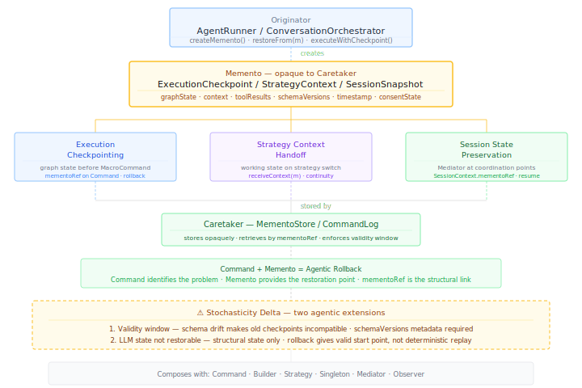

# Memento {#sec-memento}

::: {.pattern-category}
Behavioural · Pattern 12 of 14
:::

::: {.gof-box}
Without violating encapsulation, capture and externalise an object's internal state so that the object can be restored to this state later.

::: {.gof-source}
@gamma1994design, p. 283
:::
:::

## The Translation Argument

The Memento pattern solves a state preservation problem. When a component's internal state needs to be captured at a point in time — so that it can be restored later without exposing its internal structure to anyone else — Memento externalises the state into an opaque object. The Originator creates and reads the Memento. The Caretaker stores it without looking inside. The encapsulation guarantee holds throughout.

In agentic AI, this pattern is already in production. LangGraph's thread-scoped checkpointing is a direct Memento implementation: state is saved against a thread identifier, and the agent can be rehydrated into a fresh container and continue from the last checkpoint if the original environment fails [@langgraph2024persistence]. The pattern name may not be used, but the structure is identical. Three distinct agentic instantiations emerge.

**Execution checkpointing** — graph state captured at key execution points, enabling rollback after failure and continuation after interruption. The `mementoRef` field on every Command object points to the checkpoint taken before that command executed.

**Strategy context handoff** — working state captured when switching reasoning strategies mid-execution. The incoming strategy receives the prior strategy's accumulated context — tool results, reasoning trace, failed approaches — via `receiveContext(memento)`. The purpose here is continuity, not rollback.

**Session state preservation** — session-level state captured by the Mediator at coordination points. Long-running sessions resume rather than restart. Each agent delegation carries the current `mementoRef` in its `SessionContext`.

The three GoF roles translate as follows:

| GoF Role | Agentic Equivalent | Responsibility |
|---|---|---|
| Originator | `AgentRunner`, `ConversationOrchestrator` | Creates Mementos from its own state at key points. Restores state from a returned Memento. The only component that knows the Memento's contents. |
| Memento | `ExecutionCheckpoint`, `StrategyContext`, `SessionStateSnapshot` | Opaque state snapshot. Contains graph state, accumulated context, tool results, active configuration, singleton resource versions. Opaque to the Caretaker. |
| Caretaker | `MementoStore`, `CommandLog` | Stores and retrieves Mementos without examining their contents. The CommandLog acts as Caretaker when `mementoRef` fields link Command records to their corresponding checkpoints. |

: GoF roles translated to the agentic state preservation context {#tbl-memento-roles}

## The Command-Memento Composition {#sec-memento-command}

Memento's most important structural relationship in this catalogue is its composition with Command. Neither pattern alone achieves what they achieve together.

**Command** records what happened — the full provenance of every action, with a `mementoRef` pointing to the state snapshot taken before that command executed. It answers: what went wrong, who issued it, with what inputs, at what time.

**Memento** records the system state when it happened — a snapshot of execution state, session context, and active configuration. It answers: what was the state before this went wrong.

Together they provide agentic rollback: the Command Log identifies which command produced the problem; the `mementoRef` on that Command points to the checkpoint taken before it executed; the Caretaker returns that Memento to the Originator; the Originator restores its prior state; the problematic command can be re-issued with corrected inputs or the pipeline proceeds without it.

A Command Log without Memento tells you what went wrong but cannot restore prior state. Memento snapshots without Command records provide restoration points but no structured way to identify which one to restore to or why. For any system action in a regulated context, the `mementoRef` link means you can reconstruct the exact state the system was in when that action was taken — a replayable record of system state at each decision point.

## The Stochasticity Delta {#sec-memento-delta}

::: {.callout-warning .callout-delta}
## Stochasticity Delta

**Mementos have a validity window.** In GoF, a Memento captured at time T is valid for restoration at any future time. In agentic AI, a Memento may become stale or incompatible. If the `ToolSchemaCatalog` singleton was updated between capture and restoration, restoring to that checkpoint may reconstruct a pipeline configured against an outdated schema. Mementos require timestamps and compatibility metadata — a `schemaVersions` field recording which singleton resource versions were active at capture time. LangGraph addresses this by tying each checkpoint to the graph definition version active when it was saved.

**Restoration does not guarantee original behaviour.** Even after restoring a pipeline to a prior checkpoint and re-issuing the problematic command, LLM-based components may produce different outputs. Memento restores structural and contextual state. It cannot restore the probabilistic state of any LLM involved in the pipeline. Rollback gives a valid starting point; it does not guarantee a different or better outcome on re-execution.
:::

## Structural Diagram

The minimal diagram (@fig-memento-minimal) shows the Originator, the three Memento types, the Caretaker, the Command-Memento composition, and the stochasticity delta.

{#fig-memento-minimal}

## Canonical Example — NLI Checkpointing and Session Resilience

In NLI, all three Memento instantiations operate simultaneously.

**Execution checkpointing** is managed by the `AgentRunner`. Before each `MacroCommand` executes, the `AgentRunner` captures an `ExecutionCheckpoint` containing accumulated tool results, reasoning trace, active consent state, and active schema versions. The checkpoint reference is stored in the Command record's `mementoRef` field. If the cycle produces a flagged output, the `MementoStore` retrieves the checkpoint and the `AgentRunner` restores its state for re-execution.

**Strategy context handoff** occurs when the `AgentRunner` substitutes strategies mid-execution. A `StrategyContext` Memento captures the partial work — what was tried, what failed, what context was accumulated. The incoming strategy receives this via `receiveContext(memento)` and continues without repeating completed work.

**Session state preservation** is managed by the `ConversationOrchestrator`. At each coordination milestone, the orchestrator captures a `SessionStateSnapshot` and passes its reference in every subsequent agent delegation's `SessionContext`. If the session is interrupted, the next request carries the current `mementoRef` and the orchestrator restores continuity rather than restarting.

## Composability {#sec-memento-composability}

**Command** is Memento's closest structural partner. The `mementoRef` field on every Command record is the structural link: Command identifies the action; Memento provides the state before it. Together they form the agentic rollback infrastructure — the minimum viable accountability structure for agentic systems in regulated contexts.

**Builder** uses Memento for construction rollback. If a `configureIngestion()` step fails partway through pipeline assembly, the Director restores the pipeline to its last valid construction state via a Memento rather than discarding the partially assembled pipeline.

**Strategy** uses Memento for context handoff. The working state captured on strategy substitution is the Memento the incoming strategy receives. Without this handoff, substitution means starting from scratch.

**Singleton** is captured inside Mementos. Each snapshot records which version of `SafetyConstraintStore`, `ToolSchemaCatalog`, and `EvalThresholdRegistry` was active at capture. Rollback restores not just agent state but the configuration context in which that state was valid — and signals incompatibility if singleton resources changed since capture.

**Mediator** is the Originator for session state snapshots. The `ConversationOrchestrator` captures `SessionStateSnapshots` at coordination milestones and propagates their references to the agent collective via `SessionContext`.

**Observer** can watch the `MementoStore` for restoration events. When rollback occurs, registered Observers — audit log, eval pipeline, system health dashboard — are notified. Restoration events are auditable.

::: {.composability-tags}
<strong>Command</strong> — mementoRef links action to state
<strong>Builder</strong> — construction rollback
<strong>Strategy</strong> — context handoff on substitution
<strong>Singleton</strong> — config versions captured in snapshots
<strong>Mediator</strong> — session state snapshots
<strong>Observer</strong> — restoration events observable
:::
