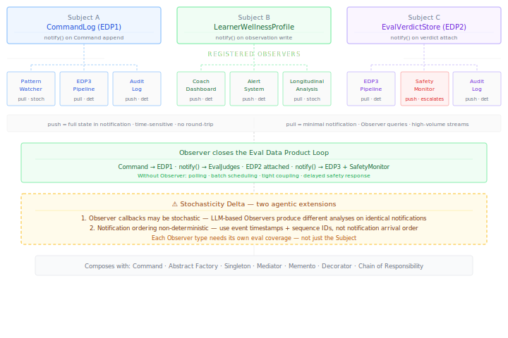

# Observer {#sec-observer}

::: {.pattern-category}
Behavioural · Pattern 13 of 14
:::

::: {.gof-box}
Define a one-to-many dependency between objects so that when one object changes state, all its dependents are notified and updated automatically.

::: {.gof-source}
@gamma1994design, p. 293
:::
:::

## The Translation Argument

The Observer pattern solves a notification problem through decoupling. A Subject maintains a list of registered Observers. When its state changes, it notifies all Observers automatically — without knowing what they will do with the notification or how many there are. Observers register and deregister dynamically. New Observer types can be added without modifying the Subject.

In classical software, Observer is the backbone of event-driven architecture — UI components responding to model changes, pub-sub messaging systems, reactive data streams. In agentic AI it does something qualitatively more significant: it is the pattern that makes a multi-agent system capable of reasoning about itself over time. When agents observe each other's outputs through a shared Subject, the system develops longitudinal awareness — detecting patterns across sessions, triggering safety interventions automatically, building analytical understanding without polling. Observer is also the pattern that makes safety monitoring architecturally separable from agent implementation. A `SafetyMonitor` Observer registered on the eval verdict store can escalate concerns without any agent knowing the monitor exists.

Three Subjects in the NLI architecture exhibit the state-change semantics that make Observer structurally appropriate:

**CommandLog (EDP1)** — every Command append triggers notification. The `PatternWatcherAgent` reacts without polling. The EDP3 aggregation pipeline reacts. New analytical Observers can be added without modifying the log or any writing agent.

**LearnerWellnessProfile** — every write triggers notification. Multiple concurrent writers produce concurrent notifications. Registered Observers — a coach dashboard, a threshold alert system, a longitudinal analysis pipeline — update their views reactively.

**EvalVerdictStore (EDP2)** — every judge verdict attachment triggers notification. The EDP3 pipeline reacts. The `SafetyMonitor` reacts and escalates low-confidence verdicts to the escalation chain. The eval pipeline is event-driven rather than batch-scheduled.

The four GoF roles translate as follows:

| GoF Role | Agentic Equivalent | Responsibility |
|---|---|---|
| Subject | `CommandLog`, `LearnerWellnessProfile`, `EvalVerdictStore` | Maintains Observer registrations. Notifies all Observers when state changes. Does not know what Observers do with notifications. |
| Observer | `PatternWatcherAgent`, `SafetyMonitor`, `CoachDashboard`, `EDP3AggregationPipeline` | Registers with one or more Subjects. Implements `update(event)`. Processes push notifications or queries Subject in pull model. |
| Concrete Subject | `EDP1CommandLog`, `LearnerWellnessProfile` | Manages state changes. Triggers `notify()` on change. Provides `getState()` for pull-model Observers. |
| Concrete Observer | `PatternWatcherAgent`, `SafetyMonitor`, `EDP3Pipeline` | Implements domain-specific response. May be stochastic if LLM-based. |

: GoF roles translated to the agentic event-driven monitoring context {#tbl-observer-roles}

## Push vs Pull — An Architectural Decision {#sec-observer-pushpull}

GoF identifies two notification models. In agentic systems the choice is an explicit architectural decision, not an implementation detail.

**Push** — the Subject includes relevant state data in the notification. The Observer receives everything it needs immediately without a follow-up query. Use for: time-sensitive events — safety flags, consent changes, health alert thresholds. Latency matters. Observer needs data immediately and in full.

**Pull** — the Subject sends only a notification that state has changed. The Observer queries for specific data it needs. Use for: longitudinal analysis — `PatternWatcherAgent` building trajectory understanding over many sessions. High-volume notification streams. Observer selects what it needs.

In NLI, the `SafetyMonitor` registered on the `EvalVerdictStore` uses push — it receives the full verdict record immediately. The `PatternWatcherAgent` registered on the `CommandLog` uses pull — it receives a minimal notification then queries for the records relevant to its current analysis window. Mixing models within the same Observer registration is an antipattern.

## Observer and the Eval Data Product Loop {#sec-observer-edp}

Observer is the pattern that completes the eval-as-data-product infrastructure built across the catalogue. Without Observer, each eval data product transition requires polling, direct coupling, or batch scheduling. With Observer the pipeline is event-driven throughout:

```
Command → EDP1 (CommandLog appended)
  ↓ CommandLog.notify() → EvalJudgePipeline.update()
Abstract Factory judges evaluate → EDP2 (verdict attached to EDP1 record)
  ↓ EvalVerdictStore.notify() → EDP3AggregationPipeline.update()
EDP3 aggregates → EDP3 (Eval Summary Metrics)
  ↓ EvalVerdictStore.notify() → SafetyMonitor.update()
SafetyMonitor escalates low-confidence verdicts → EscalationChain
  ↓ MementoStore.notify() → AuditLog.update()
Restoration events → EDP4 candidates (Gold Dataset curation)
```

New stages — a new judge type, a new analysis pipeline, a new safety monitor — register as Observers without any Subject modification. The eval infrastructure is extensible by registration, not by modification.

## The Stochasticity Delta {#sec-observer-delta}

::: {.callout-warning .callout-delta}
## Stochasticity Delta

**Observer callbacks may be stochastic.** In GoF, Observer callbacks are deterministic functions — a UI updates its display, a cache invalidates. In agentic AI, an Observer like `PatternWatcherAgent` responds to notifications by running LLM-based analysis. The same notification, received twice, may produce different pattern analyses. The same EDP2 verdict triggering the EDP3 pipeline may produce different summary metrics if any aggregation step involves LLM interpretation. Each Observer type needs its own eval coverage — not just the Subject.

**Notification ordering is non-deterministic in distributed systems.** Multiple agents may write to the `LearnerWellnessProfile` concurrently. The order in which Observer notifications are dispatched may not correspond to the logical order of writes. An Observer that assumes causal ordering from arrival order may reason incorrectly. Notifications require timestamps and monotonic sequence identifiers. Observers handling wellness profile updates must use event timestamps for causal ordering, not notification arrival order.
:::

## Structural Diagram

The minimal diagram (@fig-observer-minimal) shows three Subject instantiations — CommandLog, LearnerWellnessProfile, and EvalVerdictStore — with their registered Observers labelled push or pull, the eval data product loop, and the stochasticity delta.

{#fig-observer-minimal}

## Canonical Example — NLI Pattern Watching and Safety Monitoring

The `PatternWatcherAgent` is registered on the `CommandLog` using the pull model. When new Command records are appended, the log sends a minimal notification containing only the sequence identifier. The `PatternWatcherAgent` queries for the records relevant to its current analysis window. Its analysis involves LLM reasoning and is stochastic — the same records may yield different pattern detections on different runs. Its outputs are themselves Command records in EDP1, closing the self-observation loop.

The `SafetyMonitor` is registered on the `EvalVerdictStore` using the push model. When a judge attaches an EDP2 verdict, the full record is pushed immediately. The `SafetyMonitor` checks the confidence score against the `EvalThresholdRegistry` singleton. Below threshold, it issues the flagged content to the escalation chain — without any agent knowing the monitor exists. Safety monitoring is an Observer: it can be updated or extended without modifying any agent or judge.

The `CoachDashboard` is registered on the `LearnerWellnessProfile` using the push model. Concurrent writes from the wearable agent and reflection agent arrive in non-deterministic notification order. The dashboard uses event timestamps to reconstruct causal order before updating its display — a coach sees an accurate, temporally ordered view regardless of notification arrival order.

## Composability {#sec-observer-composability}

**Command** is Observer's most direct structural partner. The `CommandLog` is the primary Subject. Every Command appended to EDP1 triggers the notification chain that drives the eval data product pipeline.

**Abstract Factory** produces the judges whose verdicts trigger `EvalVerdictStore` notifications. Command produces EDP1; Abstract Factory produces EDP2; Observer connects EDP2 to EDP3.

**Singleton** — the Class B active data product singletons are the most natural Subjects. `LearnerWellnessProfile` and `LongitudinalLearnerModel` are authoritative, multi-writer, and continuously updated. Observer gives downstream consumers reactive access without polling.

**Mediator** manages Observer registrations for session-level events. Which agents are notified when session state changes is a Mediator concern — the `ConversationOrchestrator` controls session event subscriptions through the Observer pattern.

**Memento** generates restoration events that are observable. When rollback occurs, the `MementoStore` notifies registered Observers — audit log, eval pipeline, system health dashboard — without the rollback logic knowing about them.

**Decorator** and Observer operate at different architectural levels. `LoggingDecorator` intercepts individual calls; Observer connects stores to downstream consumers. Both contribute to observability but through different structural mechanisms.

**Chain of Responsibility** is triggered by Observer. The `SafetyMonitor` Observer, on receiving a low-confidence verdict notification, issues the flagged content to the safety escalation chain. Observer detects the condition; CoR handles the response.

::: {.composability-tags}
<span class="ctag"><strong>Command</strong> — CommandLog as primary Subject</span>
<span class="ctag"><strong>Abstract Factory</strong> — EDP2 triggers EvalVerdictStore</span>
<span class="ctag"><strong>Singleton</strong> — Class B singletons as Subjects</span>
<span class="ctag"><strong>Mediator</strong> — manages session event registrations</span>
<span class="ctag"><strong>Memento</strong> — restoration events observable</span>
<span class="ctag"><strong>Decorator</strong> — observability at call level</span>
<span class="ctag"><strong>Chain of Responsibility</strong> — triggered by Observer callbacks</span>
:::
