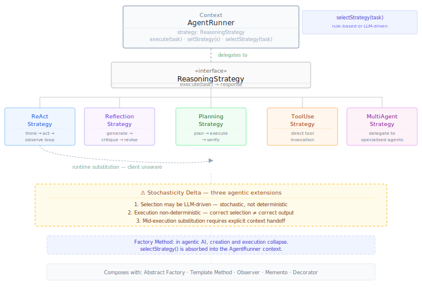

# Strategy {#sec-strategy}

::: {.pattern-category}
Behavioural · Pattern 4 of 13
:::

::: {.gof-box}
Define a family of algorithms, encapsulate each one, and make them interchangeable. Strategy lets the algorithm vary independently from clients that use it.

::: {.gof-source}
@gamma1994design, p. 315
:::
:::

## The Translation Argument

The Strategy pattern solves a substitutability problem. When a system needs to perform the same kind of task using different algorithms depending on context, Strategy encapsulates each algorithm behind a common interface and allows them to be swapped at runtime without the client knowing which one is running. The client delegates execution to whichever strategy is currently active. The algorithm varies; the client does not.

In agentic AI, the structurally equivalent problem is reasoning strategy selection. An agent tasked with answering a question, analysing data, or supporting a user through a complex process does not always reason the same way. Some tasks require step-by-step tool invocation and observation — the ReAct approach. Some require generating an output and then critiquing and revising it — Reflection. Some require constructing a high-level plan before acting — Planning. Some are simple enough to answer directly. Some require coordinating multiple specialised agents. These are not competing architectures that a system designer chooses between at design time. They are interchangeable reasoning strategies that a well-designed system selects dynamically at runtime based on task characteristics.

This reframing is a direct and substantive contribution to how the field currently thinks about agentic design. Recent practitioner roadmaps present ReAct, Reflection, Planning, Tool Use, and Multi-Agent Collaboration as five distinct patterns — implying a designer picks one and commits [@priyac2026roadmap]. The Strategy pattern dissolves that implication. These five approaches are concrete strategies behind a common `ReasoningStrategy` interface. An `AgentRunner` selects among them dynamically, substitutes when conditions change, and presents a consistent interface to downstream systems regardless of which strategy is running.

The four GoF roles translate as follows:

| GoF Role | Agentic Equivalent | Responsibility |
|---|---|---|
| Context | `AgentRunner` | Maintains a reference to the current strategy. Delegates execution via `execute(task)`. Can switch strategies at runtime without client awareness. |
| Abstract Strategy | `ReasoningStrategy` | Defines the common interface all concrete strategies implement: `execute(task) → response` |
| Concrete Strategy A | `ReActStrategy` | Implements a think-act-observe loop with tool invocation. Best for tasks requiring multi-step tool use and observation. |
| Concrete Strategy B | `ReflectionStrategy` | Generates an output then critiques and revises it iteratively. Best for tasks where output quality is the primary concern. |
| Concrete Strategy C | `PlanningStrategy` | Constructs a structured plan before acting. Best for complex, multi-step tasks with articulable structure. |
| Concrete Strategy D | `ToolUseStrategy` | Direct tool invocation without a full reasoning loop. Best for well-defined, bounded tasks with reliable tool access. |
| Concrete Strategy E | `MultiAgentStrategy` | Delegates to a coordinated set of specialised agents. Best for tasks exceeding single-agent scope or requiring parallel execution. |

: GoF roles translated to the agentic reasoning strategy context {#tbl-strategy-roles}

The responsible AI implication follows directly from the substitutability guarantee. Because all strategies implement the same interface, the eval layer attached to the `AgentRunner` applies consistently regardless of which strategy is running. Strategy selection decisions — which strategy was chosen, why, and what it produced — are logged as governed data assets: versioned, schematised, and queryable across runs.

## The Factory Method Tension {#sec-strategy-tension}

The Strategy pattern sits in productive tension with the GoF Factory Method pattern, and that tension is worth making explicit.

::: {.callout-note .callout-tension}
## Pattern Relationship — Strategy and Factory Method

In the GoF catalogue, Strategy and Factory Method solve cleanly different problems. Strategy governs *execution*: which algorithm runs, and how it can be substituted. Factory Method governs *creation*: which class gets instantiated, and who decides. In a system using both, Factory Method creates the strategy object and Strategy executes it. The concerns are separable.

In agentic AI, this separation collapses. The decision about which reasoning strategy to use is itself often a reasoning process. An agent appraising a task and selecting the appropriate strategy is exercising metacognitive judgment — assessing task complexity, available tools, prior performance, and time constraints before committing to an approach. That appraisal may be rule-based and deterministic, or it may be LLM-driven and stochastic. Either way, it is not the neutral constructor call that Factory Method assumes.

Because creation and execution are entangled in agentic systems, Factory Method does not earn a standalone entry in this catalogue. The concern it would address is absorbed here: the `AgentRunner`'s strategy selection logic, whether deterministic or LLM-driven, is treated as part of the Strategy context rather than as a separate creation pattern.
:::

## The Stochasticity Delta {#sec-strategy-delta}

::: {.callout-warning .callout-delta}
## Stochasticity Delta

**Strategy selection may itself be stochastic.** In GoF, the Context selects a strategy deterministically. In agentic AI, if an LLM appraises the task and selects a strategy, the same task presented twice may yield different selections. This makes the selection mechanism a source of non-determinism upstream of the strategy's own execution. Deterministic rule-based selection avoids this but sacrifices adaptability.

**Strategy performance is non-deterministic.** Even the correctly selected strategy may fail to produce adequate outputs. GoF algorithms are deterministic — a quicksort always sorts correctly. An LLM-based reasoning strategy may reason incorrectly, hallucinate tool results, or reach a plausible but wrong conclusion. The Strategy pattern guarantees the right type of reasoning is applied. It cannot guarantee the reasoning will succeed.

**Strategy switching introduces context continuity risk.** When a running strategy is substituted mid-execution — a `PlanningStrategy` replaced by `ReActStrategy` because the plan is failing — the accumulated reasoning context must transfer cleanly. In GoF, swapping a sorting algorithm carries no state. In agentic AI, the incoming strategy needs the prior strategy's working state: tool results, intermediate conclusions, failed approaches, accumulated observations. Without explicit context handoff, the new strategy repeats work or reasons inconsistently with prior steps. This context continuity requirement has no GoF equivalent and must be designed into the `AgentRunner` explicitly.
:::

The metacognitive dimension of strategy selection deserves particular attention. In a sophisticated agentic system, the `AgentRunner`'s selection logic is not merely a classifier — it is a metacognitive monitoring process. The agent assesses its own task, resources, and constraints and regulates its approach accordingly. This maps directly to Flavell's metacognitive monitoring and regulation framework [@flavell1979metacognition]: the agent monitors its reasoning process and substitutes strategies when the current approach is judged inadequate.

## Structural Diagram

The minimal diagram (@fig-strategy-minimal) shows the AgentRunner as Context, the abstract ReasoningStrategy interface, the five concrete strategies, the runtime substitution mechanism, and the stochasticity delta.

{#fig-strategy-minimal}

## Canonical Example — Learning Analytics Agent

Consider an intelligent learning support agent deployed within a platform such as FLoRA or ChatMate. The agent receives a diverse range of student interactions — factual questions, complex problem-solving requests, essay feedback requests, study planning queries, and cross-dataset analytical tasks — and must reason appropriately for each without the student knowing which reasoning approach is running.

A student asking a direct factual question receives a `ToolUseStrategy` response: the agent retrieves the relevant content without a full reasoning loop. A student working through a multi-step problem receives `ReActStrategy`: the agent thinks through each step, invokes tools as needed, and observes results before proceeding. A student requesting feedback on a draft essay receives `ReflectionStrategy`: the agent generates initial feedback, critiques it, and revises before delivering. A student asking for a personalised study plan receives `PlanningStrategy`: the agent constructs a structured plan before producing any output. A query requiring synthesis across multiple students' data triggers `MultiAgentStrategy`: the agent delegates to specialised sub-agents and synthesises their outputs.

Mid-session, if `PlanningStrategy` produces a plan that the student immediately identifies as misaligned with their constraints, the `AgentRunner` substitutes `ReActStrategy` and continues — passing the plan, the student's objection, and the accumulated session context to the incoming strategy via `receiveContext()`. The student experiences a seamless continuation. The strategy switch, the rationale for it, and the context handoff are all logged as governed data assets alongside the session record.

## Composability {#sec-strategy-composability}

**Abstract Factory** provides the eval suite that assesses each strategy's outputs and selection appropriateness. The `AgentRunner`'s `configureEvals()` call produces a strategy-aware eval family — judges that know which strategy ran and can assess whether it was the right choice for the task.

**Template Method** describes the `AgentRunner`'s own workflow. The execution skeleton — receive task, select strategy, execute, evaluate, return — is fixed. The pluggable step is `execute(strategy)`. Strategy and Template Method are complementary: Template Method describes the AgentRunner's structure, Strategy describes what runs within it.

**Observer** notifies downstream components when a strategy switch occurs. A logging component, a dashboard, or a student model may need to know that the agent shifted from `PlanningStrategy` to `ReActStrategy` mid-session — both for transparency and for longitudinal analysis.

**Memento** provides the mechanism for context handoff across strategy switches. The prior strategy's working state is captured as a Memento snapshot and passed to the incoming strategy via `receiveContext()`. Memento also enables rollback: if the incoming strategy cannot make productive use of the prior context, the system can restore the prior strategy's state.

**Decorator** wraps individual strategies with cross-cutting concerns — rate limiting, logging, guardrail enforcement — without modifying the strategy implementations.

**A note on Factory Method.** In the GoF catalogue, Factory Method would govern which concrete strategy is instantiated. In agentic AI, that creation decision is entangled with execution — selecting a reasoning strategy is itself a reasoning act. Factory Method is not a separate entry in this catalogue. Its concern is absorbed into the `AgentRunner`'s `selectStrategy()` logic.

::: {.composability-tags}
<strong>Abstract Factory</strong> — strategy-aware eval suite
<strong>Template Method</strong> — AgentRunner as workflow skeleton
<strong>Observer</strong> — strategy switch notification
<strong>Memento</strong> — context handoff and rollback
<strong>Decorator</strong> — cross-cutting strategy wrapping
<strong>Factory Method</strong> — absorbed into selectStrategy()
:::
