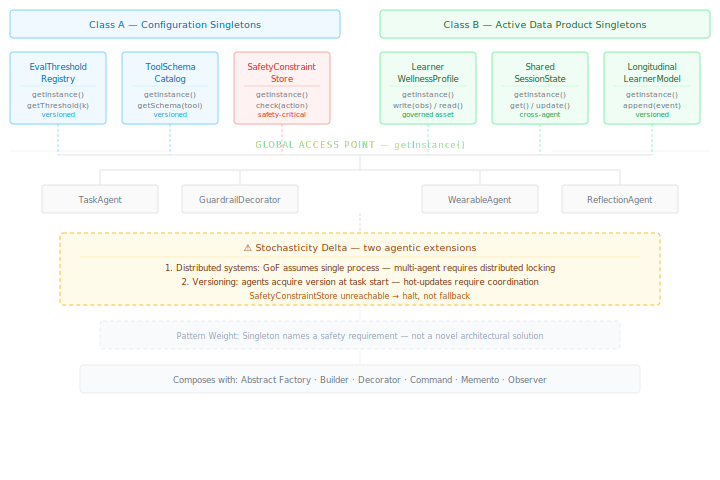

# Singleton {#sec-singleton}

::: {.pattern-category}
Creational · Pattern 3 of 13
:::

::: {.gof-box}
Ensure a class has only one instance, and provide a global point of access to it.

::: {.gof-source}
@gamma1994design, p. 127
:::
:::

## The Translation Argument

The Singleton pattern solves an instantiation control problem. When a resource must exist as exactly one instance — a configuration registry, a connection pool, a logger — Singleton ensures that only one instance is ever created and provides a global access point to it. The concern is not performance or convenience. It is correctness: multiple instances of certain resources produce inconsistency, and inconsistency in those resources produces incorrect system behaviour.

In agentic AI, the meaningful concern is different from classical instantiation control. Agents are often stateless between calls by design, and "one instance" is not a meaningful concept in the same way it is for an object. The meaningful concern is this: certain resources in a multi-agent system must be treated as authoritative singletons — not because creating multiple instances is expensive, but because allowing multiple divergent instances is unsafe or incoherent.

Two distinct classes of singleton resource exist in agentic systems, and the distinction matters:

**Class A — Configuration Singletons.** Static or slow-changing resources that must be identical across all agents. Divergence is a safety or consistency risk. Instances: `EvalThresholdRegistry`, `ToolSchemaCatalog`, `SafetyConstraintStore`.

**Class B — Active Data Product Singletons.** Dynamic resources that multiple agents read from and write to. Divergence produces incoherent outputs and breaks downstream consumers. Instances: `LearnerWellnessProfile`, `SharedSessionState`, `LongitudinalLearnerModel`.

Configuration singletons are defensive — their value is in preventing inconsistency. Active data product singletons are collaborative — their value is in enabling multiple agents to contribute coherently to a shared governed asset. Both classes share the core Singleton property: one authoritative instance, globally accessible, with no divergent copies.

The responsible AI argument is strongest for the `SafetyConstraintStore`. A multi-agent system in which different agents hold different versions of safety constraints — even briefly, during a deployment or update — has exploitable gaps. Singleton enforces the invariant that safety is uniform across the entire agent fleet at all times. This is an accountability requirement, not an architectural nicety. Similarly, a `LearnerWellnessProfile` that is a governed singleton — with a clear owner, defined schema, version history, and single authoritative instance — meets the standard of eval as data product [@dehghani2022data]. Fragmented agent outputs writing to separate stores produce neither accountability nor coherence.

::: {.callout-note .callout-scope}
## Pattern Weight

Singleton is the most structurally thin mapping in this catalogue. Its primary contribution is not architectural sophistication — it is the naming of a safety and governance requirement that agentic systems must satisfy regardless of whether they know the pattern. The value of including it is that it gives that requirement a vocabulary, connects it to a known principle, and makes explicit that certain resources cannot be allowed to diverge across agents.
:::

## The Stochasticity Delta {#sec-singleton-delta}

::: {.callout-warning .callout-delta}
## Stochasticity Delta

**The distributed systems problem.** GoF Singleton assumes a single-process environment where "one instance" is enforceable by the language runtime. Multi-agent systems are distributed: agents may run in separate processes, containers, or machines. Enforcing true singleton semantics requires distributed locking, consensus protocols, or a centralised service. An unreachable `SafetyConstraintStore` must halt agent execution rather than falling back silently to a local copy. A Singleton that is temporarily unreachable is worse than no Singleton at all if agents fall back to local defaults silently.

**The versioning and hot-update problem.** GoF Singleton instances are effectively static — once created, they do not change. Agentic singleton resources must be updatable: safety constraints evolve, tool schemas change when APIs update, eval thresholds are recalibrated as systems mature, and learner wellness profiles accumulate new data continuously. Agents mid-execution should not experience a constraint or schema change that invalidates their current reasoning state. This requires versioned access: agents acquire a version of the singleton at the start of a task and work with that version throughout. This versioning and hot-update concern has no GoF equivalent.
:::

## Structural Diagram

The minimal diagram (@fig-singleton-minimal) shows both singleton classes, their instances, the global access point, representative client agents, and the stochasticity delta.

{#fig-singleton-minimal}

## Canonical Example — Wellness Monitoring Pipeline

Consider the athletic performance platform introduced in the Builder pattern chapter. The `ReflectivePipelineBuilder` assembles a pipeline in which a wearable ingestion agent, an LMS connector agent, and a reflection agent operate concurrently. Each agent needs access to both classes of singleton resource.

The wearable ingestion agent acquires a version of the `ToolSchemaCatalog` at task start to validate its sensor API calls, and consults the `SafetyConstraintStore` before writing any physiological observation that could trigger a health alert. The LMS connector agent acquires the same tool schema version and validates its LMS API calls against it. The reflection agent consults the `EvalThresholdRegistry` when its associated eval suite produces a verdict.

All three agents write to the `LearnerWellnessProfile` — a Class B singleton. The wearable agent writes physiological observations with timestamps and sensor metadata. The reflection agent writes qualitative self-report observations with session identifiers. The LMS agent writes academic performance indicators. Because all three write to a single authoritative instance, the `LearnerWellnessProfile` accumulates a coherent, cross-modal record. A coach dashboard querying the profile receives a unified view — not three separate agent outputs requiring manual reconciliation.

When the `SafetyConstraintStore` is updated to add a new physiological risk threshold, the update is coordinated across the fleet before any agent proceeds with the next task. No agent holds an outdated constraint set. The update is versioned in the store's history and captured in the next Memento snapshot, so the change is auditable and reversible.

## Composability {#sec-singleton-composability}

**Abstract Factory** consults the `EvalThresholdRegistry` when producing judge instances. The threshold that determines whether a judge verdict passes or fails is singleton configuration — identical across all instances of that judge type regardless of which factory produced them.

**Builder** accesses the `ToolSchemaCatalog` during `configureIngestion()` and `configureInsightAgents()` steps. Each concrete builder validates its tool configurations against the singleton catalog before assembling the pipeline.

**Decorator** consults the `SafetyConstraintStore` in the `GuardrailDecorator` intercept step. Because the constraint store is a singleton, this check is guaranteed to be identical regardless of which agent produced the output or which decorator instance performs the check.

**Command** validates tool invocation inputs against the `ToolSchemaCatalog` before execution. Each Command object acquires the current schema version at instantiation time, ensuring replayable tool calls are validated against the schema that was active when they were created.

**Memento** captures singleton resource versions as part of pipeline state snapshots. A snapshot records which version of the `SafetyConstraintStore`, `ToolSchemaCatalog`, and `EvalThresholdRegistry` were active at the time of capture. Rollback to a prior snapshot restores not just agent state but the configuration context in which that state was valid.

**Observer** watches the `LearnerWellnessProfile` and `LongitudinalLearnerModel` for updates. When new observations are written by any agent, registered observers — a coach dashboard, an alert system, a longitudinal analysis component — are notified and update their views. The singleton guarantee means all observers watch the same authoritative instance.

::: {.composability-tags}
<strong>Abstract Factory</strong> — threshold registry for judges
<strong>Builder</strong> — schema catalog at construction
<strong>Decorator</strong> — safety store in guardrail layer
<strong>Command</strong> — schema validation at invocation
<strong>Memento</strong> — version capture in snapshots
<strong>Observer</strong> — watching active data products
:::
