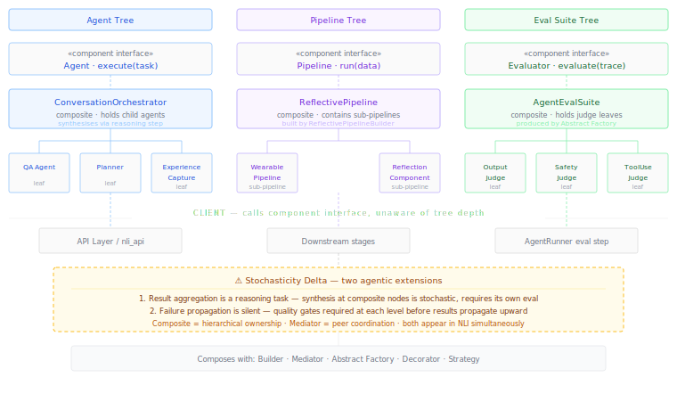

# Composite {#sec-composite}

::: {.pattern-category}
Structural · Pattern 6 of 14
:::

::: {.gof-box}
Compose objects into tree structures to represent part-whole hierarchies. Composite lets clients treat individual objects and compositions of objects uniformly.

::: {.gof-source}
@gamma1994design, p. 163
:::
:::

## The Translation Argument

The Composite pattern solves a uniformity problem. When a system contains both individual objects and compositions of objects — and when clients should be able to treat them identically — Composite gives them a shared interface. A leaf node and a composite node both implement `execute()`. The client passes work to a node without knowing whether it will be handled by a single object or delegated through a whole tree of them. Compositions can be nested arbitrarily deep and the client code stays unchanged.

In agentic AI systems, the structurally equivalent problem is hierarchical agent organisation. A single agent and a multi-agent orchestrator should share the same `Agent` interface — `execute(task) → response`. The API layer passes a task to a node in the agent tree. Whether that response emerges from one agent reasoning alone, from an orchestrator coordinating three sub-agents, or from a nested hierarchy several levels deep, the client is unaffected. Composite makes that uniformity architectural rather than incidental.

Three levels of the NLI architecture exhibit Composite structure simultaneously:

**Agent tree.** The `ConversationOrchestrator` is a composite agent. It implements the same `Agent` interface as any leaf agent — `PersonalDataQAAgent`, `ExperienceCaptureAgent`, `PlannerCoachAgent` — but internally it holds a collection of child agents and delegates to them based on intent routing. The API layer calls `orchestrator.execute(task)` and receives a response. The routing, delegation, and synthesis are invisible.

**Pipeline tree.** A `ReflectivePipeline` contains a `WearablePipeline` as a sub-component. Both implement the same `Pipeline` interface. The Builder pattern constructs these hierarchies; Composite describes their shape. Adding a new sub-pipeline requires only adding a new child to the composite — downstream consumers are unaffected.

**Eval suite tree.** An `AgentEvalSuite` is a composite of individual judges. Calling `suite.evaluate(trace)` propagates down to each leaf judge, collects their verdicts, and aggregates a synthesised result. The Abstract Factory produces eval suite trees; Composite governs how verdicts propagate and aggregate through them.

The four GoF roles translate as follows:

| GoF Role | Agentic Equivalent | Responsibility |
|---|---|---|
| Component | `Agent` interface | Defines the common interface: `execute(task) → response`. Both leaf agents and composite agents implement it. |
| Leaf | `PersonalDataQAAgent`, `PlannerCoachAgent`, individual judges | Implements the component interface directly. Has no children. Does the actual reasoning work. |
| Composite | `ConversationOrchestrator`, `AgentEvalSuite`, nested pipelines | Holds a collection of children. Delegates execution and aggregates results via a synthesis step. |
| Client | API layer, downstream pipeline stages | Calls `execute(task)` on the component interface. Unaware of whether the node is a leaf or composite. |

: GoF roles translated to the agentic hierarchical agent context {#tbl-composite-roles}

The responsible AI implication is significant for the eval tree. Because the eval suite is a composite, adding a new judge type — a `PrivacyComplianceJudge`, a `BiasDetectionJudge` — requires only adding a new leaf to the appropriate eval factory product. Eval coverage grows incrementally without architectural disruption.

## The Mediator Tension {#sec-composite-tension}

::: {.callout-note .callout-tension}
## Pattern Relationship — Composite and Mediator

Composite and Mediator both address multi-agent organisation but from structurally opposite directions.

**Composite** is hierarchical. A composite agent explicitly holds references to its children. It knows what it contains. Delegation is top-down and explicit. The composite node is responsible for the outputs of its children.

**Mediator** is flat. Agents are peers that communicate through a central coordinator. No agent holds references to other agents. The mediator knows about everyone; the agents know about no-one but the mediator. There is no hierarchy and therefore no parent-child authority relationship.

In NLI, the `ConversationOrchestrator` does Mediator work — it coordinates peer agents without owning them. Nested pipelines do Composite work — a `ReflectivePipeline` owns and is responsible for its sub-pipelines. Both patterns appear simultaneously at different architectural levels. Composite implies ownership and result aggregation; Mediator implies coordination without ownership.
:::

## The Stochasticity Delta {#sec-composite-delta}

::: {.callout-warning .callout-delta}
## Stochasticity Delta

**Result aggregation is a reasoning task.** In GoF Composite, aggregating results up the tree is deterministic — sum numbers, concatenate strings. In an agentic composite, aggregating the outputs of multiple LLM-based child agents into a coherent parent response is itself a reasoning task that can fail or produce inconsistent results. The composite node needs its own synthesis logic — not mechanical aggregation but genuine reconciliation of potentially conflicting sub-agent outputs. That synthesis is stochastic, may introduce errors not present in any child output, and requires its own evaluation.

**Failure propagation is silent.** GoF Composite assumes children either succeed or throw an exception. Agentic leaf agents fail ambiguously — they produce plausible but incorrect outputs with no signal. A composite agent receiving subtly wrong inputs from a child will reason on top of those errors, potentially amplifying them. Composite agent trees therefore require explicit quality gates at each level: a child's output must be evaluated before it propagates upward to the parent's synthesis step.
:::

The recursive relationship between agent trees and eval trees is worth making explicit. Each level of the agent composite tree maps to a level of the eval composite tree. Leaf agents have leaf judges. Composite agents have composite eval suites that include a synthesis-quality judge alongside the leaf-level judges. As the agent tree grows, the eval tree grows with it.

## Structural Diagram

The minimal diagram (@fig-composite-minimal) shows the three levels of Composite structure in NLI — agent tree, pipeline tree, and eval suite tree — with the shared component interface, leaf nodes, composite nodes, and the stochasticity delta.

{#fig-composite-minimal}

## Canonical Example — NLI Agent and Eval Trees

In the NLI system, three Composite structures operate simultaneously, each at a different architectural level.

At the **agent level**, the `ConversationOrchestrator` is the top-level composite node. It holds references to four leaf agents. When a user submits a query, the API layer calls `orchestrator.execute(task)`. The orchestrator routes the task to the appropriate child agents, collects their responses, and synthesises a unified reply. The internal routing, delegation, and synthesis are invisible to the API layer.

At the **pipeline level**, the `ReflectivePipeline` assembled by the `ReflectivePipelineBuilder` contains a `WearablePipeline` as a sub-component. Adding a new sub-pipeline — an LMS pipeline, a health records pipeline — requires only adding a new child to the composite, not modifying downstream consumers.

At the **eval level**, the `AgentEvalSuite` produced by each `AgentEvalFactory` is a composite of individual judges. The `AgentRunner` calls `suite.evaluate(trace)`. The suite propagates to each judge leaf, collects verdicts, and aggregates a synthesised pass/fail. Adding a `PrivacyComplianceJudge` requires only registering a new leaf in the factory — no changes to calling code.

## Composability {#sec-composite-composability}

**Builder** constructs composite trees at construction time. Composite describes their shape at runtime. The two are structurally complementary — Builder for assembly, Composite for traversal.

**Mediator** is the alternative for multi-agent coordination. Composite for hierarchical ownership where parent nodes are responsible for children; Mediator for peer coordination without ownership. Both appear in NLI at different levels — understanding which applies where prevents architectural confusion as the system grows.

**Abstract Factory** produces the eval suite trees that mirror the agent trees. Each composite agent node gets a composite eval suite. The recursive relationship between agent structure and eval structure is maintained through the factory's product families.

**Decorator** applies to individual leaf nodes without affecting the composite structure. A `GuardrailDecorator` wrapping a leaf agent adds safety checking without the composite node or the client knowing. Decorator operates on individual nodes; Composite operates on the tree.

**Strategy** governs the reasoning approach at each node independently. A composite agent may use `MultiAgentStrategy` at the top level while leaf children use `ReActStrategy` or `ToolUseStrategy`. Strategy and Composite are orthogonal — Composite describes tree shape, Strategy describes reasoning at each node.

::: {.composability-tags}
<strong>Builder</strong> — constructs composite trees
<strong>Mediator</strong> — peer coordination alternative
<strong>Abstract Factory</strong> — eval trees mirror agent trees
<strong>Decorator</strong> — wraps leaf nodes independently
<strong>Strategy</strong> — reasoning at each node independently
:::
