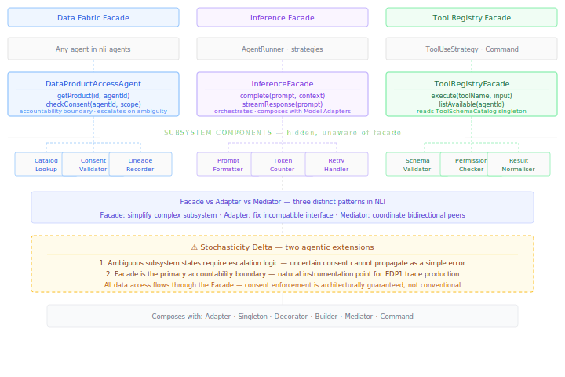

# Facade {#sec-facade}

::: {.pattern-category}
Structural · Pattern 7 of 14
:::

::: {.gof-box}
Provide a unified interface to a set of interfaces in a subsystem. Facade defines a higher-level interface that makes the subsystem easier to use.

::: {.gof-source}
@gamma1994design, p. 185
:::
:::

## The Translation Argument

The Facade pattern solves a complexity problem. A subsystem may be perfectly well-designed — each component doing its job correctly — but collectively too complex for client code to navigate safely. Multiple components, multiple interfaces, multiple dependencies, multiple failure modes. Facade provides a single clean entry point. The client calls the Facade; the Facade handles the subsystem's internal complexity. The client is decoupled from everything behind the Facade. The subsystem remains unchanged; only access to it is simplified.

Before establishing the agentic mappings, the relationship between Facade and two neighbouring structural patterns deserves explicit statement. **Facade versus Adapter:** Adapter makes an incompatible interface compatible — the problem is a mismatch between what the client expects and what the component provides. Facade simplifies a complex subsystem — the interfaces are not wrong, they are numerous and interdependent. **Facade versus Mediator:** Mediator coordinates bidirectional peer communication between agents. Facade provides one-directional simplification — clients call the Facade, the Facade calls the subsystem, the subsystem components do not know about clients or the Facade. All three patterns appear in NLI simultaneously, doing different things at different levels.

Three subsystems in agentic AI consistently exhibit the complexity that Facade addresses:

**Data Fabric Access** — hides catalog lookup, consent validation, lineage recording, access enforcement, and audit logging behind `getProduct(id, agentId)`. Five independent subsystem components, one client call.

**LLM Inference** — hides prompt formatting, token counting, retry logic, streaming protocol handling, error normalisation, and cost tracking behind `complete(prompt, context)`. The Facade handles orchestration; the Model Layer Adapter handles provider translation.

**Tool Registry** — hides tool discovery, schema validation against the `ToolSchemaCatalog` singleton, permission checking, rate limiting, and result normalisation behind `execute(toolName, input)`.

The three GoF roles translate as follows:

| GoF Role | Agentic Equivalent | Responsibility |
|---|---|---|
| Facade | `DataProductAccessAgent`, `InferenceFacade`, `ToolRegistryFacade` | Provides the simplified interface. Orchestrates subsystem components internally. The single entry point the client calls. |
| Subsystem Classes | DataZone catalog, consent service, lineage recorder; prompt formatter, token counter, retry handler; schema validator, permission checker, result normaliser | Each does one thing well. No knowledge of the Facade or of clients. |
| Client | Any agent in `nli_agents`, any reasoning strategy | Calls only the Facade interface. Unaware of subsystem components, their number, or their interdependencies. |

: GoF roles translated to the agentic subsystem simplification context {#tbl-facade-roles}

The responsible AI implication of the Data Fabric Facade is direct. Because all data access flows through a single entry point, consent enforcement is guaranteed at the Facade boundary — not distributed across agents where inconsistency is harder to detect. The Facade is also the natural instrumentation point for the eval data product pipeline: attaching a `LoggingDecorator` to the Facade rather than to individual agents provides complete subsystem interaction coverage with a single instrumentation point.

## Pattern Tensions {#sec-facade-tensions}

::: {.callout-note .callout-tension}
## Facade vs Adapter vs Mediator — three distinct patterns in NLI

**Facade** simplifies. The DataZone system has five valid APIs that work correctly in isolation but require careful orchestration. The `DataProductAccessAgent` Facade handles that orchestration.

**Adapter** translates. The LMS produces grade data that does not conform to the canonical `EngagementTrajectoryDataProduct` schema. The `LMSDataAdapter` translates it. The problem is interface incompatibility, not subsystem complexity. A Facade may internally use Adapters — the InferenceFacade uses Model Layer Adapters for provider translation.

**Mediator** coordinates. The `ConversationOrchestrator` manages bidirectional peer communication between agents. Agents communicate through it; it knows about all of them. A Facade's subsystem components do not know about the Facade or about clients — communication is one-directional.
:::

## The Stochasticity Delta {#sec-facade-delta}

::: {.callout-warning .callout-delta}
## Stochasticity Delta

**Ambiguous subsystem states require escalation logic.** In GoF, if a subsystem component fails the Facade propagates a clean error. In agentic AI, subsystem components can fail ambiguously. A consent service returning an uncertain status — the individual has partially modified sharing permissions in a way that applies to some data products but not others — cannot be handled with simple error propagation. The Data Fabric Facade must decide whether to block access entirely, return a degraded data product, or escalate to the `EscalationSafetyAgent`. This escalation decision logic has no GoF equivalent. It requires the Facade to reason about subsystem state rather than simply reflect it.

**The Facade is the primary accountability boundary.** Because all data access flows through the Facade, it is the natural instrumentation point for the eval data product pipeline. A `LoggingDecorator` wrapping the Facade records every subsystem interaction with full provenance — which agent called what, with what inputs, at what time, with what result — producing EDP1 traces without any agent modification. Consent enforcement, lineage recording, and audit logging are guaranteed at the Facade boundary, not distributed across agents where gaps are harder to detect.
:::

## Structural Diagram

The minimal diagram (@fig-facade-minimal) shows the three Facade instantiations in NLI — Data Fabric, Inference, and Tool Registry — with the simplified interface each exposes, the subsystem components each hides, and the stochasticity delta.

{#fig-facade-minimal}

## Canonical Example — NLI Data Fabric, Inference, and Tool Access

The NLI system contains three Facade instantiations, each simplifying a different subsystem.

The **DataProductAccessAgent** sits between all eleven NLI agents and the AWS DataZone federated data fabric spanning four custodial domains. Any agent needing data calls `dataAccess.getProduct(productId, agentId)`. The Facade validates consent, records lineage, enforces access, and logs the interaction before returning the data product. If consent status is ambiguous, the Facade escalates to the `EscalationSafetyAgent` rather than returning a simple error or silently proceeding.

The **InferenceFacade** sits between the `AgentRunner` and the model inference infrastructure. It handles prompt formatting, token counting, retry logic, streaming protocol differences, error normalisation, and cost tracking. The `AgentRunner` calls `inference.complete(prompt, context)` and receives a `Response` object. Whether the response came from Claude, GPT-4o, or a local model is invisible. The Facade internally uses the Model Layer Adapter for each provider.

The **ToolRegistryFacade** sits between strategies that invoke tools and the tool execution infrastructure. It validates inputs against the `ToolSchemaCatalog` singleton, checks permissions, enforces rate limits, executes the tool through the appropriate Tool Layer Adapter, and normalises the result. A `ToolUseStrategy` calls `toolRegistry.execute(toolName, input)` and receives a canonical `ToolOutput`. The strategy never knows which underlying API was called.

In all three cases, attaching a `LoggingDecorator` to the Facade provides complete subsystem interaction coverage with a single instrumentation point.

## Composability {#sec-facade-composability}

**Adapter** composes with Facade at the subsystem level. The InferenceFacade orchestrates Model Layer Adapters for each provider. The ToolRegistryFacade orchestrates Tool Layer Adapters for each tool. Facade handles orchestration of concerns; Adapter handles translation of interfaces. The two patterns are complementary and frequently appear together in the same subsystem.

**Singleton** is consulted by two of the three Facades. The ToolRegistryFacade reads the `ToolSchemaCatalog` on every call. The DataProductAccessAgent reads the `SafetyConstraintStore` for consent and access enforcement.

**Decorator** wraps Facades to add observability without modifying them. A `LoggingDecorator` wrapping the DataProductAccessAgent captures EDP1 traces for every data access. The Decorator stack sits above the Facade; the Facade sits above the subsystem.

**Builder** assembles the appropriate Facades during pipeline construction. The `configureIngestion()` step selects and configures the DataProductAccessAgent for the data sources in scope.

**Mediator** is the explicit contrast pattern. The `ConversationOrchestrator` coordinates peer agents bidirectionally — agents communicate through it. The DataProductAccessAgent simplifies subsystem access one-directionally. Both involve a central component but their structural logic is opposite.

**Command** connects through the ToolRegistryFacade. Every tool invocation is encapsulated as a Command with full provenance — tool name, input, output, agent ID, timestamp — giving each tool interaction its status as a governed data asset.

::: {.composability-tags}
<strong>Adapter</strong> — subsystem-level translation
<strong>Singleton</strong> — schema and safety constraint stores
<strong>Decorator</strong> — observability above the facade
<strong>Builder</strong> — facade assembly at construction
<strong>Mediator</strong> — explicit contrast pattern
<strong>Command</strong> — tool invocations as governed assets
:::
